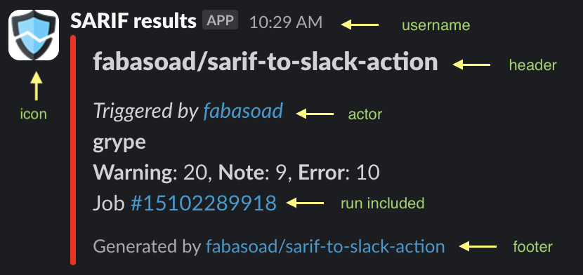

# SARIF to Slack action

[](https://stand-with-ukraine.pp.ua)


[](https://codecov.io/gh/fabasoad/sarif-to-slack-action)

This GitHub action sends a notification to Slack based on the provided SARIF file.

## Contents

<!-- TOC -->
* [SARIF to Slack action](#sarif-to-slack-action)
  * [Contents](#contents)
  * [Inputs](#inputs)
  * [Outputs](#outputs)
  * [Sample](#sample)
  * [Contributions](#contributions)
<!-- TOC -->

## Inputs

```yaml
- uses: fabasoad/sarif-to-slack-action@v1
  with:
    # (Required) Target Slack webhook URL.
    slack-webhook: "${{ secrets.SLACK_WEBHOOK }}"
    # (Required) Path to the directory with SARIF files or to the SARIF file itself.
    # Separate Slack messages will be sent for each SARIF file found in the directory.
    sarif-path: "scanning-results.sarif"
    # (Optional) Log level of output. Possible options are "silly", "trace",
    # "debug", "info", "warning", "error", "fatal". This parameter is ignored if
    # CI pipeline is running in debug mode, e.g. ACTIONS_STEP_DEBUG is set to "true".
    # Defaults to "info".
    log-level: "trace"
    # (Optional) Specifies the custom log message template to format log outputs,
    # using the same template format as the tslog npm library. More details here:
    # https://github.com/fullstack-build/tslog?tab=readme-ov-file#pretty-templates-and-styles-color-settings
    # Defaults to "[{{logLevelName}}] [{{name}}] {{dateIsoStr}} ".
    log-template: "[{{dateIsoStr}}] level={{logLevelName}} "
    # (Optional) Specifies how the summary results in the Slack message are
    # calculated from the SARIF file(s) analysis. Possible values:
    # - "level": Calculates results by the "results[].level" property, or by the
    #   "rules[].properties['problem.severity']" property if "results[].level"
    #   property does not exist (such as error, warning, note).
    # - "severity": Calculates results by the "rules[].properties['security-severity']"
    #   property that has CVSS score. Then this score is transformed into severity
    #   value (such as critical, high, medium, low, none).
    # Defaults to "severity".
    calculate-by: "severity"
    # (Optional) Controls how analysis results from the SARIF file are grouped
    # and summarized in the Slack message. Possible values:
    # - "tool-name": Groups results by tool name, combining and summarizing results
    #   from all runs that use the same tool.
    # - "run": Groups results by each individual SARIF run, even if multiple runs
    #   use the same tool.
    # - "total": No grouping; combines all results from all runs and provides a
    #   single overall summary.
    # Defaults to "tool-name".
    group-by: "tool-name"
    # (Optional) What color of the message should be in hex format. Defaults to
    # "#ff0000".
    color: "#ff0000"
    # (Optional) Slack message username. Defaults to "SARIF results".
    username: "${{ github.repository }}"
    # (Optional) Slack message icon URL. Defaults to the default Slack icon.
    # Defaults to no icon.
    icon-url: "https://cdn-icons-png.flaticon.com/512/9070/9070006.png"
    # (Optional) Slack message header. Defaults to $GITHUB_REPOSITORY.
    header: "Security scanning results"
    # (Optional) Whether to include header in the message. Defaults to "true".
    include-header: "true"
    # (Optional) Slack message footer. Defaults to "Generated by
    # @fabasoad/slack-to-sarif@<version>".
    footer: "This message was sent by GitHub Actions"
    # (Optional) Whether to include footer in the message. Defaults to "true".
    include-footer: "true"
    # (Optional) Who triggered the run. Defaults to $GITHUB_ACTOR.
    actor: "${{ github.actor }}"
    # (Optional) Whether to include actor in the message. Defaults to "true".
    include-actor: "true"
    # (Optional) Whether to include run in the message. Defaults to "true".
    include-run: "true"
```

## Outputs

None.

## Sample



## Contributions


